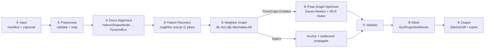

# RDL.GerberStitch

Façade library đóng gói pipeline **align + stitch ảnh Gerber** (port từ repo `tony71200/GerberViewer`, nhánh `2026-08-04_Ver4_implement_claude`) để hệ thống **RDL Master/Worker AOI** (solution khác, ngoài repo này) reference và gọi. Đây là phần **Phase 0/1** của roadmap tích hợp Gerber Align & Stitch vào luồng AOI hiện có.

> Nguyên tắc gốc của tích hợp: **không thay flow AOI chính** — Gerber Align/Stitch chỉ thêm vào như một `WorkModel` mới, song song với luồng hiện tại. Chi tiết đầy đủ: [`docs/roadmap_GerberAlignStitch_integration_EN.md`](docs/roadmap_GerberAlignStitch_integration_EN.md).

---

## Kiến trúc

```
RDL.GerberStitch (façade)  ──depends on──►  GerberStitching.Core, GerberEngine
RDL.GerberStitch.Harness   ──depends on──►  RDL.GerberStitch (+ GerberStitching.Core cho nhánh createsample)
```

| Project | Vai trò |
|---|---|
| **`GerberEngine`** | Parser/renderer file Gerber thuần tuý (`GerberParser`, `GerberRenderer`). Không phụ thuộc HALCON/OpenCV. |
| **`GerberStitching.Core`** | Namespace `GerberViewer.Stitching` — pipeline align + stitch đầy đủ (xem [Luồng xử lý](#luồng-xử-lý-align--stitch-pose-graph-ver-4) bên dưới). Phụ thuộc HALCON 25.05 + OpenCvSharp4 4.13. |
| **`RDL.GerberStitch`** | **Façade duy nhất** mà Master/Worker được reference. 3 hàm chính: `GenerateSampleManifest`, `GenerateSampleManifestFromRaster`, `RunAlignStitch`. |
| **`RDL.GerberStitch.Harness`** | Console app test façade với dữ liệu thật — không phải project test (NUnit/xUnit). |

Toàn bộ quy tắc bắt buộc khi sửa code nằm ở [`AGENTS.md`](AGENTS.md) / [`CLAUDE.md`](CLAUDE.md) — đọc trước khi thao tác trên bất kỳ file nào.

---

## Luồng xử lý Align + Stitch (Pose-Graph, Ver 4)

`GerberStitching.Core` triển khai đúng luồng mô tả trong [`flow_v4.md`](flow_v4.md) / [`Flow_V4.html`](Flow_V4.html) (bản trình bày trực quan, có mermaid diagram). Entry point: `AlignStitchWorkflowService.RunAsync` → `RunCore`.



**9 giai đoạn chính:**

1. **Input** — validate manifest + captured folder, tạo `.creating/` (RunOutputLifecycle).
2. **Preprocess** — `AlignStitchConfigMapper.EnsureComposite`/`SyncLegacy`, map ảnh↔tile theo `OrderIndex`.
3. **Direct Alignment** — mỗi tile: coarse `HalconShapeModel` (HALCON `find_shape_model`) → refinement `PyramidEcc` (OpenCV `findTransformECC`). Đây là **giai đoạn chiếm ~90% tổng thời gian** (đo được thực tế: 222–285s / 247–303s tổng, xem [`docs/Phase0_Closeout.md`](docs/Phase0_Closeout.md)).
4. **Failure Recovery** — tile fail được cứu qua neighbor (2 pass: predecessor-only, rồi cả predecessor+successor).
5. **Neighbor Graph** — đo **toàn bộ** cặp tile kề Manhattan bằng `PyramidPhaseCorrelation`, ghi `RecoveryEdges`. Ver 4: nếu Pose-Graph bật, giai đoạn này **chỉ đo, không propagate**.
6. **Pose-Graph Optimizer** (điểm khác biệt của Ver 4 so với bản cũ) — giải pose toàn cục bằng Gauss-Newton + IRLS Huber trên toàn bộ node/edge cùng lúc, thay vì lan truyền tuần tự qua anchor. Có guard `MaxPoseCorrectionPixels` để không áp dụng nếu kết quả dịch quá xa.
7. **Validation** — kiểm tra scale/rotation/finite/canvas, connectivity giữa các tile.
8. **Stitching** — `HOperatorSet.GenProjectiveMosaic` (engine `HalconProjectiveMosaicRebased`, mặc định của façade). HALCON không hỗ trợ blending seam — biết trước, không phải bug.
9. **Output** — ghi `Stitched.tiff`, `processing_report.json`, publish `.creating/` → thư mục cuối.

**Số liệu tham chiếu thật** (dataset 80 tile, xem [`docs/Phase0_Closeout.md`](docs/Phase0_Closeout.md) và [`docs/Phase1_Task06.md`](docs/Phase1_Task06.md)):

| | Giá trị đo được |
|---|---|
| Tổng thời gian | 247–303 s (Direct Alignment chiếm ~90%) |
| RAM đỉnh | ~6.5–6.6 GB (canvas ~40k×32k) |
| Seam residual trước/sau pose-graph | median 5.35 px → 0.38 px |
| Kích thước `Stitched.tiff` | ~1.3 GB (engine HALCON), ~654 MB (engine OpenCv) |

---

## Trạng thái triển khai façade

| Hàm | Trạng thái | Dùng khi |
|---|---|---|
| `GenerateSampleManifest(gerberFilePath, ...)` | ✅ Đã triển khai + chạy thật | Input là file Gerber gốc (`.gbr`) — render qua `GerberEngineFacade` trước khi cắt tile |
| `GenerateSampleManifestFromRaster(rasterImagePath, ...)` | ✅ Đã triển khai + chạy thật | Input là ảnh raster **đã render sẵn** (`.tiff`) — đọc thẳng bằng HALCON, không render lại |
| `RunAlignStitch(manifestPath, capturedImagesFolder, ...)` | ✅ Đã triển khai + chạy thật | Worker chạy Align→PoseGraph→Stitch cho cả lô |

Cả 3 hàm đã được kiểm chứng bằng dữ liệu thật qua `RDL.GerberStitch.Harness` (không phải chỉ build được — đã **chạy** và **so khớp** với run tham chiếu). Chi tiết thiết kế, các đánh đổi, và lỗi/cách fix gặp phải trong lúc triển khai: [`docs/implement_code.html`](docs/implement_code.html).

---

## Build

```bash
msbuild RDL.GerberStitch.sln /p:Configuration=Release /p:Platform=x64
```

- Yêu cầu biến môi trường **`HALCONROOT`** trỏ tới HALCON 25.05 Progress.
- Target **x64** duy nhất — không build AnyCPU/x86.
- NuGet packages (OpenCvSharp4, System.Drawing.Common...) đã có sẵn trong `packages/`.

## Chạy thử với dữ liệu thật

```bash
RDL.GerberStitch.Harness\bin\x64\Release\RDL.GerberStitch.Harness.exe
```

2 mode: `--mode alignstitch` (mặc định) và `--mode createsample`. Tham số đọc từ CLI arg hoặc `global_config.json` cạnh `.exe` (arg luôn thắng). Chi tiết: [`docs/Phase1_Task06.md`](docs/Phase1_Task06.md).

---

## Tài liệu

| File | Nội dung |
|---|---|
| [`docs/roadmap_GerberAlignStitch_integration_EN.md`](docs/roadmap_GerberAlignStitch_integration_EN.md) | Roadmap tích hợp đầy đủ — bối cảnh, quyết định kiến trúc, 6 phase |
| [`docs/Phase0_Closeout.md`](docs/Phase0_Closeout.md) | Chốt Phase 0 bằng số liệu 6 run thật; các quyết định (HALCON 25.05, giữ OpenCvSharp) |
| [`docs/Phase1_Task01.md`](docs/Phase1_Task01.md) – [`Task06.md`](docs/Phase1_Task06.md) | Từng task Phase 1, đều có mục "Đã triển khai" đối chiếu kế hoạch ↔ code thật |
| [`docs/deploy_deps.md`](docs/deploy_deps.md) | Checklist dependency khi deploy `RDL.GerberStitch.dll` vào Master/Worker |
| [`docs/implement_code.html`](docs/implement_code.html) | Nhật ký triển khai — file đã đổi, lưu ý, lỗi & cách fix, theo từng lượt thực thi |
| [`flow_v4.md`](flow_v4.md) / [`Flow_V4.html`](Flow_V4.html) | Luồng kỹ thuật chi tiết pipeline Pose-Graph (Ver 4) trong `GerberStitching.Core` |
| [`AGENTS.md`](AGENTS.md) | Quy tắc bắt buộc cho mọi agent (Claude Code, Copilot, Codex...) khi sửa repo này |
| [`CLAUDE.md`](CLAUDE.md) | Hướng dẫn riêng cho Claude Code — build, kiến trúc, quy ước |

---

## Việc còn treo

- **Blocker 3/4 chưa tháo** (`docs/Phase0_Closeout.md` §5): dung lượng ổ chia sẻ thật (~1.3 GB/lô) và grid config khớp lưới chụp thật của dây chuyền RDL.
- **Nâng HALCON trên Master/Worker** — 2 app đó hiện dùng `halcondotnetxl` 18.11.1.1, cần nâng lên 25.05 trước khi deploy `RDL.GerberStitch.dll` (ngoài phạm vi repo này, xem `docs/Phase1_Task03.md` §1.1).
- **Model HALCON pregenerate** (`SampleModelGenerationMode.Pregenerate`) đã có code nhưng **chưa đo được** mức tiết kiệm thời gian thật.
- **`--repeat N`** trong harness để soi rò RAM qua nhiều lần chạy liên tiếp — chưa triển khai (`docs/Phase1_Task05.md`, mục SUPERSEDED).
