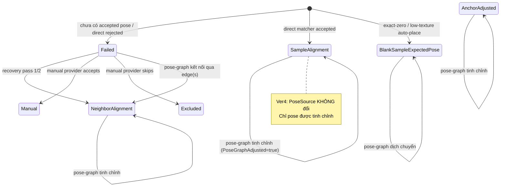

# FLOW_V4.md — Tab 3: Alignment and Stitching (Ver 4 — Pose-Graph)

## 1. Mục đích

Tài liệu này mô tả **chi tiết dòng hoạt động** của Tab 3 — Alignment and Stitching, phiên bản Ver 4 bao gồm **Global Pose-Graph Least Squares Optimizer**. Mọi tên hàm, biến, class, thông số cấu hình đều phản ánh chính xác code trên nhánh `2026-08-04_Ver4_implement_claude`.

---

## 2. Flowchart tổng quát

```mermaid
flowchart TD
    subgraph INPUT["① INPUT — Nhận ảnh"]
        A1[Người dùng chọn Sample Manifest + Captured folder]
        A2[UI: ValidateRunInputs]
        A3["RunOutputLifecycle: tạo finalRunDir/.creating"]
        A4["UI: CloneForRun(OutputPath = .creating)"]
    end

    subgraph PREPROCESS["② PREPROCESSING — Tiền xử lí"]
        B1["AlignStitchConfigMapper.EnsureComposite(config)"]
        B2["AlignStitchConfigMapper.SyncLegacy(config)"]
        B3["WorkflowImageMappingService.ValidateAndMap"]
        B4["ProcessingReport.Create(config, manifest)"]
        B5["AlignStitchConfigMapper.CreateSnapshot → report.EffectiveConfig"]
    end

    subgraph DIRECT["③ DIRECT ALIGNMENT — Align từng tile"]
        C1["Loop ordered tiles: SolveDirect / SolveDirectWithMatcherFactory"]
        C2["Preprocessing: Contrast = 200%"]
        C3["Coarse: HalconShapeModel → find_shape_model"]
        C4["Refinement: PyramidEcc → findTransformECC"]
        C5["DirectCandidateEvaluator → DirectCandidateSelector.Apply"]
        C6["GlobalPose = T(ExpectedX+ManualOffsetX, ...) × CapturedToSample"]
        C7["Lưu OriginalDirectGlobalPose (Debug + Release)"]
    end

    subgraph RECOVERY["④ FAILURE RECOVERY — Cứu tile thất bại"]
        D1["Pass 1: Recover(includeSuccessor=false)"]
        D2["Pass 2: Recover(includeSuccessor=true)"]
        D3["BuildRecoveryCandidates → MatchNeighborEdge"]
        D4["NeighborCandidateRanker.Rank → CompleteRecoveryFromAnchor"]
    end

    subgraph NEIGHBOR["⑤ NEIGHBOR GRAPH — Đo toàn bộ edge"]
        E1["ReconcileNeighborGraph"]
        E2["Enumerate tất cả cặp Manhattan-neighbor"]
        E3["MatchNeighborEdge: PyramidPhaseCorrelation trên overlap ROI"]
        E4["Ghi report.RecoveryEdges"]
        E5{PoseGraph.Enabled?}
        E6["Legacy: anchor select + max-bottleneck propagate + AnchorAdjusted"]
    end

    subgraph POSEGRAPH["⑥ POSE-GRAPH OPTIMIZER — Giải pose toàn cục"]
        F1["GlobalPoseGraphOptimizer.Optimize"]
        F2["Build nodes: prior = OriginalDirectGlobalPose, λ theo PoseSource"]
        F3["Edge gate: loại period-slip, finite check, phase/overlap thresholds"]
        F4["Khử trùng lặp: giữ edge có phaseScore cao nhất mỗi cặp"]
        F5["Tính connected components + IsolatedTiles"]
        F6["GlobalSimilarityFit.TryFit → (s, φ, gx, gy)"]
        F7["PoseGraphSolver.Solve → Gauss-Newton + IRLS Huber"]
        F8["Guard: MaxPoseCorrectionPixels → Applied true/false"]
        F9["Apply: ghi lại GlobalPose per tile, PoseSource transitions"]
    end

    subgraph VALIDATE["⑦ VALIDATION"]
        G1["ValidateGlobalPoses: scale/rotation/finite/canvas check"]
        G2["GlobalPoseValidator.Validate"]
        G3["Ghi report.Poses + report.TileReports"]
    end

    subgraph STITCH["⑧ STITCHING — Ghép ảnh"]
        H1["WorkflowStitchingService → GlobalTransformStitcher"]
        H2["HOperatorSet.GenProjectiveMosaic → Stitched.tiff"]
        H3["(Không blending — HALCON không hỗ trợ)"]
    end

    subgraph OUTPUT["⑨ OUTPUT — Xuất kết quả"]
        I1["SampleComparisonService.Generate → comparison artifacts"]
        I2["Ghi processing_report.json"]
        I3["RunOutputLifecycle.Publish(.creating → finalRunDir)"]
        I4["UI validate/rebase/bind published artifacts"]
    end

    INPUT --> PREPROCESS --> DIRECT --> RECOVERY --> NEIGHBOR
    E5 -->|Yes| POSEGRAPH
    E5 -->|No| E6
    E6 --> VALIDATE
    POSEGRAPH --> VALIDATE
    VALIDATE --> STITCH --> OUTPUT
    NEIGHBOR --> E5
```



---

## 3. Chi tiết từng giai đoạn

---

### ① INPUT — Nhận ảnh và cấu hình

**Trigger:** Người dùng nhấn Run trên `AlignStitchingControl`.

**Flow:**

1. `AlignStitchingControl.ValidateRunInputs()` — kiểm tra manifest path, captured folder, output path hợp lệ.
2. `RunOutputLifecycle.CreateOrVerify(finalRunDir)` — tạo `finalRunDir/.creating/`.
3. `AlignStitchingControl.CloneForRun()` — clone effective config với `OutputPath = .creating`.
4. UI subscribe `MatcherResultAvailable` event.
5. Gọi `AlignStitchWorkflowService.RunAsync(config, manifest, captured, progress, ct)`.

**Biến đầu vào chính:**

| Biến | Kiểu | Nguồn |
|---|---|---|
| `config` | `AlignStitchConfig` | UI PropertyGrid, clone cho run |
| `manifest` | `SampleManifest` | JSON từ Tab 2 |
| `captured` | `IList<CapturedImageInfo>` | Folder ảnh chụp |

---

### ② PREPROCESSING — Validate và Map

**Entry point:** `RunCore()` trong `AlignStitchWorkflowService`

**Flow:**

```
AlignStitchConfigMapper.EnsureComposite(config)
   └── Đảm bảo config composite (DirectAlignment, NeighborAlignment, Recovery, PoseGraph, Stitching, Output) 
       đều non-null, fill defaults nếu thiếu

AlignStitchConfigMapper.SyncLegacy(config)
   └── Đồng bộ flat legacy field ↔ composite object

ct.ThrowIfCancellationRequested()

imageMap = WorkflowImageMappingService.ValidateAndMap(manifest, captured, ct)
   ├── Validate: SampleCount == CapturedCount
   ├── Không duplicate/missing OrderIndex
   └── Return: TileByOrder, CapturedByOrder, OrderedCaptured

report = ProcessingReport.Create(config, manifest)
report.EffectiveConfig = AlignStitchConfigMapper.CreateSnapshot(config)
```

**Output:**

| Biến | Mô tả |
|---|---|
| `imageMap.TileByOrder` | `Dictionary<int, SampleTileInfo>` |
| `imageMap.CapturedByOrder` | `Dictionary<int, CapturedImageInfo>` |
| `imageMap.OrderedCaptured` | `IList<CapturedImageInfo>` sắp theo OrderIndex |
| `solved` | `Dictionary<int, TileWorkflowState>` — khởi tạo rỗng |

---

### ③ DIRECT ALIGNMENT — Align từng tile với sample

**Entry point:** Vòng `for` trên `ordered` trong `RunCore()`

**Cấu hình Direct Alignment (user-specified):**

```
DirectAlignment:
├── Preprocessing:
│   └── Contrast = 200                      # Tăng contrast ảnh captured trước khi match
├── CoarseMatcher = HalconShapeModel        # Coarse matcher
├── RefinementMatcher = PyramidEcc          # Refinement matcher
├── Geometry:
│   ├── MinTextureStdDev = 7                # Ngưỡng std dev để phân loại low-texture
│   ├── MinOverlapRatio = 0.01 (default)
│   ├── MaxTranslationPixels = 300 (default)
│   ├── MaxAbsRotationDeg = 0.5 (default)
│   ├── MinScale = 0.95 (default)
│   └── MaxScale = 1.05 (default)
├── Shape:
│   ├── Greediness = 0.75                   # Tham số tìm kiếm HALCON find_shape_model
│   ├── Mode = (default)
│   ├── NumLevels = (default)
│   ├── AngleStartRad, AngleExtentRad, AngleStepRad = (default)
│   ├── MinScore = (default)
│   └── SubPixel, Contrast, MinContrast, ... = (default)
├── Ncc: (không dùng — CoarseMatcher = HalconShapeModel)
├── Ecc:
│   ├── MotionModel = Euclidean (default)
│   ├── PyramidLevels = 3 (default)
│   ├── MaxIterations = 80 (default)
│   ├── Epsilon = 1e-5 (default)
│   └── MinCorrelation = 0.13 (default)
└── Policy:
    ├── AllowCoarseOnlyAcceptance = true     # Chấp nhận chỉ coarse nếu refinement fail
    └── AllowRefinementFromExpectedWhenCoarseFails = true (default)
```

**Flow chi tiết mỗi tile:**

```
GetSampleContent(config, tile)
   └── SampleTileContentAnalyzer.Analyze() → SampleTileContentMetrics
       ├── ContentClass: Normal / LowTexture / ExactZero
       └── StdDevGray, MinGray, MaxGray, MeanGray, NonZeroPixelRatio

if ContentClass == ExactZero && AutoPlaceExactZeroSample:
   → PoseSource.BlankSampleExpectedPose, pose = T(ExpectedX, ExpectedY)

if ContentClass == LowTexture && MinTextureStdDev = 7:
   → skip matching, PoseSource.BlankSampleExpectedPose

Nếu tile bình thường:
   SolveDirectWithMatcherFactory(config, tile, cap, report, ct, metrics)
   │
   ├── MatcherPipeline(_matcherFactory, ForwardMatcherResult)
   │
   ├── Build MatchRequest:
   │   ├── ReferenceImage = _imageCache.GetMono8(tile.ExpectedPath)
   │   ├── MovingImage = _imageCache.GetDirectMovingMono8(cap.FilePath, Contrast=200)
   │   │                 └── Linear contrast stretch: pixel = clamp((pixel-128)*2 + 128)
   │   ├── ReferenceShapeModelPath = tile.ShapeModelPath
   │   ├── ReferenceShapeModelRoi = ToShapeRoi(tile)
   │   ├── ShapeOptions = config.DirectAlignment.Shape  (Greediness=0.75)
   │   └── Options = AlignStitchConfigMapper.ToDirectMatcherOptions(config)
   │
   ├── pipeline.MatchDirect(request, coarse=HalconShapeModel, refinement=PyramidEcc, 
   │                        allowCoarseOnly=true, allowRefFromExpected=true, ct)
   │   │
   │   ├── Coarse: HalconShapeModelMatcher
   │   │   └── HALCON find_shape_model(Image, ModelID, AngleStart, AngleExtent, 
   │   │       MinScore, NumMatches, MaxOverlap, SubPixel, NumLevels, Greediness=0.75)
   │   │       → Row, Column, Angle, Score
   │   │
   │   └── Refinement: PyramidEccMatcher
   │       └── OpenCV findTransformECC(src, dst, warpMatrix, MOTION_EUCLIDEAN,
   │           criteria(MaxIterations=80, Epsilon=1e-5), inputMask, PyramidLevels=3)
   │       → MovingToReferenceTransform (2D affine/euclidean)
   │
   ├── DirectCandidateEvaluator.Evaluate() (nếu Evaluation enabled)
   ├── DirectCandidateSelector.Apply(result, evaluation, evaluationOptions)
   │
   └── Nếu match.Success:
       │   directGlobal = Multiply(
       │       Translation(ExpectedX + ManualOffsetX, ExpectedY + ManualOffsetY),
       │       CapturedToSampleTransform
       │   )
       │   state.OriginalDirectGlobalPose = clone(directGlobal)
       │   → PoseSource.SampleAlignment
       │
       └── Nếu match.Fail:
           → PoseSource.Failed
```

**Transform direction contract:**

```
CapturedToSampleTransform:  MovingImage → ReferenceImage  (captured → sample tile)
DirectGlobalPose = T(ExpectedX, ExpectedY) × CapturedToSample
                 = tile offset trong global frame × local alignment
```

---

### ④ FAILURE RECOVERY — Cứu tile thất bại bằng neighbor

**Trigger:** Tile có `PoseSource.Failed` và `config.Recovery.RecoverFailedTiles == true`

**Pass 1** (`includeSuccessor = false`):

```
Recover(config, tile, cap, solved, ordered, capturedByOrder, tileByOrder, report, ct, false)
│
├── BuildRecoveryCandidates(cap, solved, ordered, includeSuccessor=false)
│   ├── traversal-predecessor (OrderIndex - 1) nếu IsStitchable
│   └── solved-grid-neighbor: mọi tile kề Manhattan đã stitchable, sắp theo distance+OrderIndex
│
├── Với mỗi candidate:
│   MatchNeighborEdge(config, tile, cap, anchorOrderIndex, ...)
│   ├── Xác định direction: "right"/"left"/"top"/"bottom"
│   ├── AnchorRoi / TargetRoi từ tile geometry (overlap = ExpectedOverlap, ~60px)
│   ├── CropCopy overlap regions
│   ├── PyramidPhaseCorrelationMatcher trên ROI
│   ├── RoiTransformToFull: chuyển transform từ ROI space → full tile space
│   ├── NeighborTransformModel.ExpectedTargetToAnchor(anchorTile, targetTile)
│   ├── NeighborTransformModel.Residual(expected, measured)
│   └── NeighborMatchAcceptance.Validate → accepted/rejected
│
├── NeighborCandidateRanker.Rank(measured edges)
│   └── Sắp theo: accepted first → phaseScore desc → overlapRatio desc
│
└── CompleteRecoveryFromAnchor(target, best_candidate, best_edge)
    └── GlobalPose = AnchorGlobalPose × TargetToAnchorTransform
    └── PoseSource.NeighborAlignment
```

**Pass 2** (`includeSuccessor = true`):
Giống Pass 1 nhưng thêm `traversal-successor (OrderIndex + 1)` vào candidate list.

---

### ⑤ NEIGHBOR GRAPH — Đo toàn bộ cặp kề cạnh

**Entry point:** `ReconcileNeighborGraph()` — chỉ khi `ReconcileAllMatchedTiles == true`

**Lưu ý Ver 4:** Nếu `PoseGraph.Enabled == true` nhưng `ReconcileAllMatchedTiles == false`, service **tự bật** `ReconcileAllMatchedTiles` và ghi warning, vì optimizer cần toàn bộ edge.

```
ReconcileNeighborGraph(config, solved, ordered, capturedByOrder, tileByOrder, report, progress, ct)
│
├── Enumerate eligible pairs:
│   eligible = tiles có file tồn tại && không Excluded
│   pairs = mọi cặp (a, b) sao cho:
│       b.OrderIndex > a.OrderIndex
│       |a.Row - b.Row| + |a.Column - b.Column| == 1  (Manhattan-neighbor)
│
├── Với mỗi pair:
│   MatchNeighborEdge → RecoveryEdgeReport
│   ├── Matcher: PyramidPhaseCorrelationMatcher (phase-only, không rotation)
│   ├── pairMeasuredRotationDeg = 0  (luôn, neighbor không đo rotation)
│   │
│   ├── Nếu edge accepted && cả 2 node đã có pose:
│   │   Legacy closure check:
│   │   predicted = Multiply(anchorPose, TargetToAnchor)
│   │   closure = PoseResidual(predicted, targetPose)
│   │   Nếu closure > MaxCycleClosureErrorPixels(=12):
│   │       → edge.Accepted = false, reason = "Rejected by cycle/direct-pose closure check"
│   │
│   └── report.RecoveryEdges.Add(edge)
│
└── if config.PoseGraph.Enabled:
        return;    // ← VER 4: CHỈ ĐO, KHÔNG PROPAGATE. Optimizer xử lí.
    else:
        Legacy path: anchor selection + max-bottleneck propagation + AnchorAdjusted
```

---

### ⑥ POSE-GRAPH OPTIMIZER — Giải pose toàn cục (VER 4)

**Entry point:** `GlobalPoseGraphOptimizer.Optimize()` — sau ReconcileNeighborGraph, trước Stitching

**Trigger:** `config.PoseGraph.Enabled == true` (default: `true`)

**Cấu hình PoseGraphOptions (defaults):**

```
PoseGraph:
├── Enabled = true
├── Prior weights:
│   ├── LambdaDirect = 0.30      # SampleAlignment, scaled by SelectedCommonScore
│   ├── LambdaWeak = 0.02        # NeighborAlignment, AnchorAdjusted, Failed
│   ├── LambdaBlank = 0.02       # BlankSampleExpectedPose
│   └── LambdaPinned = 100.0     # Manual
├── Solver:
│   ├── RotationScalePixels = 4000.0    # ≈ half tile side
│   ├── HuberPixels = 3.0               # Huber robust loss threshold
│   ├── MaxIterations = 8               # Gauss-Newton iterations
│   ├── MaxCgIterations = 500           # CG inner iterations
│   └── CgTolerance = 1e-10
├── Global similarity:
│   ├── EstimateGlobalScale = true
│   ├── MinGlobalScale = 0.99
│   ├── MaxGlobalScale = 1.01
│   └── MaxGlobalRotationDeg = 0.5
├── Edge gate:
│   ├── UseRejectedEdges = true          # Dùng cả edge bị legacy closure reject
│   ├── MaxEdgeResidualPixels = 40.0     # Chống period-slip
│   └── MaxEdgeRotationDeg = 0.5
└── Safety:
    └── MaxPoseCorrectionPixels = 120.0  # Guard: abort nếu tile dịch quá xa
```

**Flow chi tiết:**

```
GlobalPoseGraphOptimizer.Optimize(config, tiles, states, edges)
│
├── 1. Build Nodes
│   ordered = states.Where(s => s.Source != Excluded).OrderBy(OrderIndex)
│   Với mỗi state:
│   │   priorMatrix = OriginalDirectGlobalPose ?? GlobalPose
│   │   Tx, Ty = initMatrix[0,2], initMatrix[1,2]   (hoặc ExpectedX/Y nếu không finite)
│   │   Theta = atan2(initMatrix[1,0], initMatrix[0,0])
│   │   Scale = sqrt(a² + b²) từ prior (giữ nguyên, không optimize)
│   │   Lambda = LambdaFor(state, options):
│   │       SampleAlignment  → LambdaDirect(0.30) × clamp(SelectedCommonScore, 0.05, 1.0)
│   │       Manual           → LambdaPinned(100.0)
│   │       BlankSample      → LambdaBlank(0.02)
│   │       Neighbor/Adjusted/Failed → LambdaWeak(0.02)
│   └── HasPrior = true nếu priorMatrix finite
│
├── 2. Edge Gate & Deduplication
│   fullEdges = edges.Where(Purpose == FullPoseReconciliation)
│   Với mỗi edge:
│   │   Reject if:
│   │   ├── !UseRejectedEdges && !Accepted        → "Not accepted by legacy, UseRejected=false"
│   │   ├── anchor/target not in nodeIndex         → "Tile excluded"
│   │   ├── MeasuredTransform not finite           → "Not finite"
│   │   ├── PhaseScore < Phase.MinResponse(0.15)   → "Below min response"
│   │   ├── OverlapRatio < Acceptance.MinOverlapRatio(0.01) → "Below min overlap"
│   │   ├── ResidualNorm > MaxEdgeResidualPixels(40) → "Period slip"
│   │   └── |RotationDeg| > MaxEdgeRotationDeg(0.5) → "Rotation exceeded"
│   │
│   │   Build PoseGraphEdge:
│   │       AnchorIndex, TargetIndex = local indices in node array
│   │       Mx, My = MeasuredTargetToAnchor[0,2], [1,2]
│   │       MTheta = atan2(M[1,0], M[0,0])
│   │       BaseWeight = sqrt(max(PhaseScore, 1e-3)) × sqrt(max(OverlapRatio, 1e-3))
│   │       HuberWeight = 1.0 (initial)
│   │
│   Khử trùng: key = (min(anchor,target), max(anchor,target))
│   └── Giữ edge có PhaseScore cao nhất mỗi cặp
│
├── 3. Connected Components (Union-Find)
│   edgeCountByNode[i]++
│   Union(anchor, target)
│   → ComponentSizes, IsolatedTiles
│
├── 4. PoseGraphSolver.Solve(problem, options)
│   │
│   │   for it = 0 .. MaxIterations-1:
│   │   │
│   │   ├── GlobalSimilarityFit.TryFit(nodes, EstimateGlobalScale)
│   │   │   Weighted Umeyama 4-DOF:
│   │   │   d̄ = Σ(λ·prior) / Σλ,  t̄ = Σ(λ·pose) / Σλ
│   │   │   Sxx = Σ λ(D·T),  Sxy = Σ λ(D×T),  Sdd = Σ λ|D|²
│   │   │   φ = atan2(Sxy, Sxx)
│   │   │   s = sqrt(Sxx² + Sxy²) / Sdd
│   │   │   g = t̄ - s·R(φ)·d̄
│   │   │   Clamp: s ∈ [0.99, 1.01], φ ∈ [-0.5°, +0.5°]
│   │   │
│   │   ├── BuildRows(nodes, edges, options, s, φ, gx, gy)
│   │   │   │
│   │   │   ├── Per edge (3 rows):
│   │   │   │   r_tx = R(θ_a)ᵀ·(t_b - t_a) - m   (x component)
│   │   │   │   r_ty = R(θ_a)ᵀ·(t_b - t_a) - m   (y component)
│   │   │   │   r_θ  = θ_b - θ_a - dθ_meas
│   │   │   │   weight = BaseWeight × HuberWeight
│   │   │   │   rotation weight *= RotationScalePixels(4000)
│   │   │   │
│   │   │   └── Per prior node (3 rows):
│   │   │       predX = s·(cosφ·PriorDx - sinφ·PriorDy) + gx
│   │   │       predY = s·(sinφ·PriorDx + cosφ·PriorDy) + gy
│   │   │       r_px = Tx - predX
│   │   │       r_py = Ty - predY
│   │   │       r_pθ = θ - (PriorTheta + φ)
│   │   │       weight = Lambda
│   │   │
│   │   ├── SparseNormalEquationCg.Solve(3n unknowns, rows, MaxCgIter=500, tol=1e-10)
│   │   │   Matrix-free CG on normal equations:
│   │   │   (JᵀWJ + εI) Δ = -JᵀW·r
│   │   │   Jacobi preconditioner: diag = Σ w²·g_j²
│   │   │   Damping: ε = 1e-9 × trace/nUnknown
│   │   │
│   │   ├── Apply delta:
│   │   │   node[i].Tx += Δ[3i]
│   │   │   node[i].Ty += Δ[3i+1]
│   │   │   node[i].Theta = wrap(Theta + Δ[3i+2])
│   │   │
│   │   └── UpdateHuberWeights:
│   │       er = ||R(θ_a)ᵀ(t_b-t_a) - m||
│   │       HuberWeight = 1.0          nếu er ≤ HuberPixels(3.0)
│   │       HuberWeight = 3.0 / er     nếu er > 3.0
│   │
│   └── Return PoseGraphSolveStats (iterations, residuals, global similarity params)
│
├── 5. Safety Guard
│   delta[i] = ||newPose - originalPose||
│   Nếu bất kì delta > MaxPoseCorrectionPixels(120):
│       Applied = false → giữ nguyên pose cũ, ghi warning
│
├── 6. Apply Solution (nếu Applied == true)
│   Với mỗi node:
│       cos, sin = cos(θ), sin(θ)
│       k = node.Scale (giữ nguyên từ direct)
│       GlobalPose = [[k·cos, -k·sin, Tx],
│                     [k·sin,  k·cos, Ty],
│                     [0,      0,     1 ]]
│       state.PoseGraphAdjusted = true
│       state.PoseGraphDeltaPixels = delta
│       PoseSource transitions:
│           Failed + có edge → NeighborAlignment (IsStitchable=true)
│           Còn lại → giữ nguyên PoseSource
│
└── 7. Return PoseGraphReport
    ├── EdgesTotal, EdgesUsed, EdgesGatedOut
    ├── GlobalScale ≈ 0.999, GlobalRotationDeg ≈ 0.059°
    ├── BeforeResidual: median ~5.35 px → AfterResidual: median ~0.38 px
    ├── ComponentSizes, IsolatedTiles
    ├── Tiles[], EdgeDiagnostics[]
    └── Warnings[]
```

---

### ⑦ VALIDATION

```
1. Non-stitchable tiles (not Excluded):
   state.GlobalPose = Translation(tile.ExpectedX, tile.ExpectedY)
   → Black placeholder position

2. ValidateGlobalPoses(config, solved, tileByOrder, report)
   Với mỗi tile stitchable:
   ├── scale = sqrt(p[0,0]² + p[1,0]²)
   ├── rotation = |atan2(p[1,0], p[0,0])| * 180/π
   ├── scale ∈ [Acceptance.MinScale, MaxScale]
   ├── rotation ≤ 180°
   ├── translation < 1e9
   └── tile Width, Height > 0
   
   Connectivity check:
   ├── roots = {SampleAlignment, Manual, BlankSampleExpectedPose}
   └── NeighborAlignment tiles phải nối được tới root qua accepted edges

3. GlobalPoseValidator.Validate(config, manifest, ordered, outputStates, recoveryEdges)
   → report.GlobalPoseValidation (per-tile diagnostics)
```

---

### ⑧ STITCHING

```
if !string.IsNullOrWhiteSpace(config.OutputPath):
│
├── Nếu PoseGraph.Enabled:
│   Skip DirectPoseOutlierCorrector
│   Ghi message: "pose graph supersedes median-angle correction"
│
├── Nếu !PoseGraph.Enabled:
│   DirectPoseOutlierCorrector.Correct(config, tiles, states)
│   → Sửa rotation outlier theo MAD
│
├── GlobalPoseValidator.Validate → safety gate
│
└── WorkflowStitchingService:
    ├── Map stitching options
    └── GlobalTransformStitcher.StitchFromGlobalTransforms
        ├── Engine = HalconProjectiveMosaicRebased
        ├── HOperatorSet.GenProjectiveMosaic(Images, ..., HomMatrices2D, StackingOrder, TransformDomain)
        ├── Không blending (HALCON không hỗ trợ blending parameter)
        └── Output: .creating/Stitched.tiff
```

---

### ⑨ OUTPUT

```
1. SampleComparisonService.Generate
   → preview, overlay, difference, edge artifacts
   → comparison_metadata.json

2. Ghi .creating/processing_report.json
   Bao gồm block "poseGraph" mới:
   {
     "enabled": true,
     "applied": true,
     "iterations": 8,
     "converged": true,
     "edgesTotal": 156,
     "edgesUsed": 142,
     "globalScale": 0.999086,
     "globalRotationDeg": 0.0592,
     "beforeResidualMedian": 5.35,
     "afterResidualMedian": 0.38,
     ...
   }

3. HALCON reopen/validate Stitched.tiff

4. RunOutputLifecycle.Publish(finalRunDir, .creating)
   └── Move file-by-file (không atomic rename)

5. UI rebase artifact paths → final directory
6. Bind comparison artifacts, hiển thị kết quả
```

---

## 4. State Flow của một tile



---

## 5. Tóm tắt thông số cụ thể (Dataset tham chiếu)

**Dataset:** `AlignStitch_20260804_110852` — 80 tile, 8 row × 10 col, serpentine column-major

| Thông số | Giá trị |
|---|---|
| Tile size | 4096 × 4096 px |
| Grid step | 4036 px |
| Overlap | 60 px |
| Coarse matcher | HalconShapeModel (Greediness = 0.75) |
| Refinement matcher | PyramidEcc |
| Preprocessing contrast | 200% |
| MinTextureStdDev | 7 |
| Direct match rate | 36/80 SampleAlignment |
| Blank tiles | 21 BlankSampleExpectedPose |
| AllowCoarseOnlyAcceptance | true |
| Neighbor edges (full reconciliation) | 156 bản ghi → 142 cặp unique |
| Global scale (fit) | ≈ 0.999086 |
| Global rotation (fit) | ≈ +0.0592° |
| Seam residual TRƯỚC pose-graph | median 5.35 px, p90 10.62, max 12.64 |
| Seam residual SAU pose-graph | median 0.38 px, p90 0.77, max 1.62 |
| Pose dịch chuyển | median 11.19 px, p90 27.63, max 40.25 |
